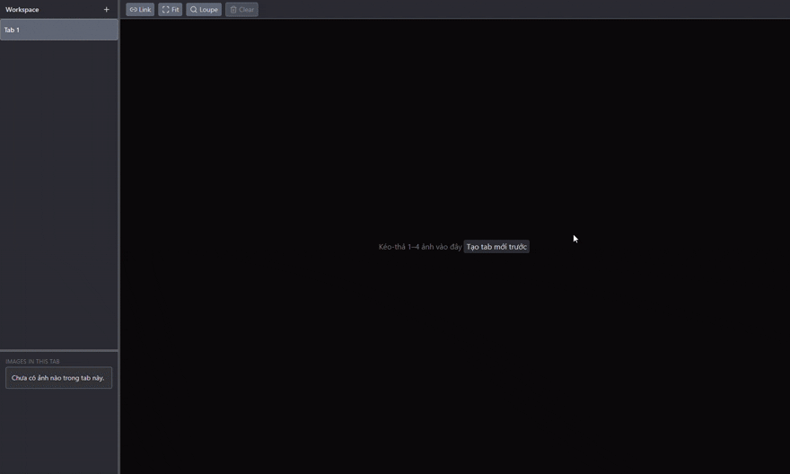
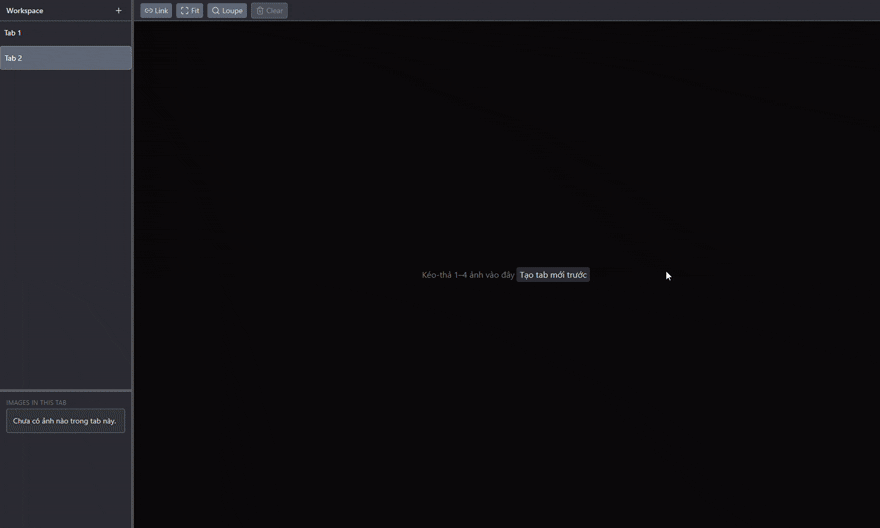

> 🦉 *“Hoo... hoo... owl never sleeps.”*
> — Cú Đại Nhân 🦉

# SyncView (PyWebview + FastAPI + React + Tailwind 4)
A lightweight desktop application to compare 1–4 images and synchronize operations.

---

## Features
- Drag and drop; auto layout: `1–3 images → 3 columns`, `4 images → 2×2`.
- Smooth pan/zoom; zoom around cursor; Double-click: Fit ↔ 2×.
- Link-All: synchronize pan/zoom of all panes.
- Loupe: change zoom and size instantly.
- Display detailed EXIF: camera information, lens, ISO, aperture, shutter, date, location (if available).
- Vertical tabs: New / Rename / Close; Autosave Last Session (restore session).
- Export `.exe` installation file for end users, no need to install Python or Node.
- Basic Hotkeys + Help overlay.

---

## Tech

### Backend
- **Python 3.11+**
- **FastAPI** (REST API framework)
- **PyWebview** (native desktop window creation)
- **Uvicorn** — ASGI server
- **AnyIO / Starlette / h11** FastAPI dependencies
- **Inno Setup** `.exe` package

### Frontend
- **React 18 + TypeScript**
- **Vite**
- **TailwindCSS + shadcn/ui** (CSS, components)
- **Zustand** (state management)
- **ESLint** (linting)

---

## Preview
Here’s a quick look at the UI:




---

## Quick Start (after clone)

### ..FOR DEV..

#### Requirements
- **Python ≥ 3.11**
- **Node LTS**
- Windows 10/11 (with **WebView2 Runtime**) or Ubuntu (with **WebKitGTK**)

#### Install Dependencies

**Frontend**
```bash
cd frontend
npm ci
npm run dev
```

**Backend**
```bash
# Windows
python -m venv .venv
.\.venv\Scripts\pip install --upgrade pip
.\.venv\Scripts\pip install -r backend\requirements.txt

# Ubuntu
python3 -m venv .venv
source .venv/bin/activate
pip install --upgrade pip
pip install -r backend/requirements.txt
```

---

### RUN
```bash
# Terminal 1 - Backend
cd backend
python run_dev.py

# Terminal 2 - Frontend
cd frontend
npm run dev
```

---

### DEV APP (PyWebview host)
```bash
# Windows
.\.venv\Scripts\python backend\run_dev.py

# Ubuntu
source .venv/bin/activate
python backend/run_dev.py
```

---

### ..FOR USER..
```bash
Output/Install-SyncView.cmd
```

Double-click `Output/Install-SyncView.cmd` to download and launch the latest
official Windows installer from GitHub Releases. Release assets also include a
portable ZIP that can be extracted and run without installation.
